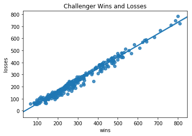
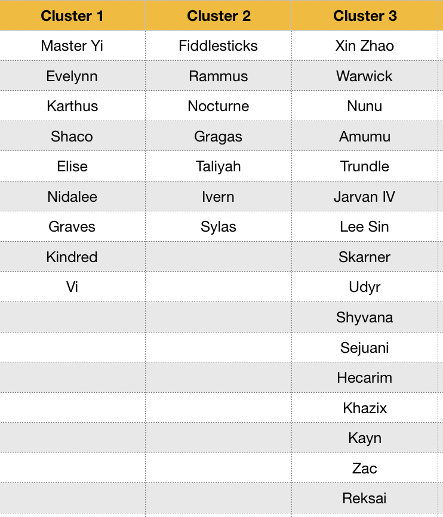

# Analysis of Laning in League of Legends and a deep dive on Qiyana, the latest champion to join the roster

  

This project is set out to look at the types of playstyles in each role of the game League of Legends. I achieve this through looking at the match history of the best players in the North American server and then grouping the champions played in the different roles. Based on that grouping I am going to look at game statistics to further group similar playstyles by champion using K-Means Clustering. I obtain 30,000 matches to ensure I have sufficient data to conduct a proper analysis of playstyles and to obtain as many matches of Qiyana as possible. 

Qiyana has been out for One week from when I obtained my data and as such the variance in her scores is bound to be high as many different players try her out and obtain an understanding of her kit. My deep dive into Qiyana is to compare her to other champions in her cluster and to determine if she is an all around better champion based on her damage output and overall utility provided using T-Tests.

# EDA

## Obtaining the Data

To obtain my data, I used the Riot API at https://developer.riotgames.com/. 

First I obtained the list of players ranked Challenger on the North American Server. Challenger is the highest rank possible in League of Legends which means players who achieve this rank are the best players on the server.

  <u><b> Challenger Player Winrates </b></u>

 

  

The graph above shows the regression plot of the wins and losses of the players ranked Challenger when I pulled my data. As the plot indicates, these players have a greater than 50% win rate which means they win more games than they lose. This is vital since winning increases a players Match Making Rating which results in a higher rank. 

The second step, after obtaining the summoner names of the players ranked Challenger was to obtain their unique Account Ids. This was achieved through a second API call.

The third and final step was to obtain the match histories of the players. I obtained 100 match histories per player resulting in 30,000 total data points. However, as I was obtain match histories, which includes 9 other players per match, their were bound to be many duplicate entries. As such, I dropped all duplicates which resulted in a total data set of around 12,000 match histories to analyze.

## Segregating the different roles

  <u><b> Challenger Lanes </b></u>

 

  

Trying to group the champions played in each role proved to be a very difficult step during the EDA process. Because there are 300 players in Challenger and based on the graph above, a majority of them are Bottom or Support, a player will be "auto-filled" into a role other then their primary role. They will then "role swap" with another player in order to obtain their primary role. For example, if someone queued up for a game hoping to play Middle or Jungle, but the game determined their role to be Bottom, then they would try to trade their role to play Middle or Jungle but the game data will still determine them to be "Bottom". As such, the graph above and the overall data can be very misleading if looked through the lens of lane assignment. 

In order to obtain an accurate picture of the current state of the game, the analysis should be determined on the common champions played in each role and manually segregate champions into different roles and perform an analysis that way. This is not the ideal situation as champions like Irelia are commonly played in the top lane and mid lane. However, for clustering purposes, the best approach is to manually assign a primary lane to each champion and group them through that. For this, I used http://na.op.gg/champion/statistics to look at the different champions in each role.

## The Clusters

After going through the champion roster and assigning each champion a main role, I was able to use K-means clustering to assess the different types of playstyles within each role. This means that I was able to see the different types of champions being played in the top lane, jungle, mid lane, bottom lane, and support. 

In the section below, I will be providing the number of clusters (play-styles) in each lane, the types of champions in each cluster, and a high level assessment on the differentiating factor of the clusters.

### Top Lane

  <u><b> Top Lane Number of Clusters </b></u>

 

  

Based on the elbow plot above, it is fairly clear that the point of diminishing returns begins at k = 3 but really becomes evident at k = 4. For this reason, I have settled on having 4 clusters for the top lane.

  <u><b> Top Lane Clusters </b></u>

 

  

As you can see from the table above, the 4 clusters have pretty distinguishing features. From a high level perspective, cluster 1 contains champions that are generally tanky and have a form of cc. Cluster 2 contains champions that have a high amount of sustain in lane or an ability that instantly gives them more HP through transformations. Cluster 3 contains champions that either are lane bullies or late game scalers. The commonality between those 2 are that they are likely to get many kills in a game. This is why this cluster averages the most kills out of all the clusters. The last cluster is interesting as it contains just three champions. The commonality with these champions is that they run at you and are considered to be "feast or famine". These champions are one-dimensional and if they don't get ahead in the early game, they are incredibly easy to shut down, especially at the highest level of play.

### Jungle

  <u><b> Jungle Number of Clusters </b></u>

 

  

Based on the elbow plot above, it is fairly clear that the point of diminishing returns begins at k = 3. For this reason, I have settled on having 3 clusters for the jungle.

  <u><b> Jungle Clusters </b></u>

 

  

Based on the average values from each cluster it is evident that cluster 1 contains the high damage, carry-style junglers. On average, champions in cluster 1 get two more kills than the champions in the other clusters. They also average 3k more damage over the course of a game over other junglers as well. Champions in cluster 2 fit the mold of being more supportive and provide crowd-control capabilities to the team. As such, these champions average the lowest gold of the clusters as well as a crowd control of ~46 while the other 2 clusters average a crowd control score of ~13 and ~20. The last cluster contain the tanks. Some of these champions are not necessarily tanks by nature, but they are considered to be early game champions that fall off in the late game, such as Xin Zhao, Lee Sin, and Reksai. This is why these champions start to build tanky items to maintain value to their team. As such, the champions in this cluster average the lowest damage out of the clusters and the highest damage taken. This cluster averages over 20% more damage taken then the next highest cluster. 

### Middle

  <u><b> Mid Lane Number of Clusters </b></u>

 

  

Based on the elbow plot above, it is fairly clear that the point of diminishing returns begins at k = 3. For this reason, I have settled on having 3 clusters for the mid lane.

  <u><b> Mid Lane Clusters </b></u>

 

  

